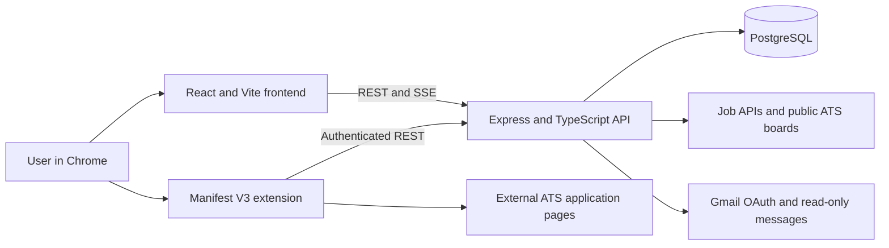

# Final design

## Product scope

RoleMatch consolidates the repeated parts of a job search into one system. A user maintains a reusable professional profile, searches normalized live postings, saves or tracks selected jobs, sees a profile-based match score, autofills supported applicant-tracking-system (ATS) forms, and links Gmail messages to application records.

The course implementation is a repeatable local deployment. It is not a mass-application service: users choose jobs individually, and automation stops when a page presents an unresolved required field, login, CAPTCHA, one-time code, or explicit consent gate.

## Architecture

| Layer | Final implementation | Responsibility |
| --- | --- | --- |
| Web client | React 19, TypeScript, Vite | Authentication, onboarding, profile, job search, saved jobs, and tracker |
| API | Node.js, Express 5, TypeScript | Authentication, normalization, matching, persistence, uploads, Gmail, and extension services |
| Database | PostgreSQL, Drizzle ORM | User-owned profiles, jobs, saved jobs, applications, documents, integrations, and encrypted ATS accounts |
| Extension | Chrome Manifest V3, JavaScript | ATS detection, profile-aware field matching, custom-answer learning, pause/resume, optional step advancement, and optional submission |
| Integrations | REST, SSE, OAuth 2.0 | Live provider search, progressive results, Gmail authorization, and application-email evidence |

## Primary workflows

1. **Onboard:** register, import a PDF/DOCX/TXT resume, review parsed fields, and add profile details or documents.
2. **Discover:** enter title and location filters; the API streams normalized results from enabled providers and calculates a profile match score without restricting the search to that score.
3. **Select:** save a posting or open it as an application. Saved jobs remain separate from tracked applications.
4. **Apply:** connect the extension, open a supported ATS page, fill visible fields, and resolve any manual gates. Optional step advancement and final submission are separate settings and are off by default.
5. **Track:** retain the original job URL and application context, update status manually or from a confirmed extension submission, and scan Gmail on demand for related messages.
6. **Learn:** save an approved unmatched question as a custom answer. Aliases let different wording map to one answer intent, with short and long variants selected by field type.

## Job ingestion and matching

The search service uses a provider-adapter boundary and normalizes postings into one `NormalizedJob` shape. Sources include Google Jobs through SerpAPI, The Muse, Adzuna, Remotive, Arbeitnow, Remote OK, USAJOBS, and public registries for Lever, Greenhouse, Ashby, SmartRecruiters, Workable, Recruitee, Personio, iCIMS, and Workday.

The committed registry contains 1,058 public ATS board identifiers across nine registry families. Results are deduplicated by canonical URL/content identity, filtered by title and selected location, and streamed through server-sent events so one slow provider does not block all visible results. Salary minimums exclude only jobs with a verified lower salary below the filter; postings without salary data remain eligible.

Match scores are explanatory ranking signals based on job title, skills, experience, education, location, employment preferences, and available description/requirement text. They do not change which jobs the providers retrieve.

## Security and privacy boundaries

- Passwords are hashed; JWT and encryption keys come from uncommitted environment variables.
- Gmail tokens and optional ATS passwords are encrypted with AES-256-GCM before database storage.
- ATS credentials resolve only for the authenticated user and an exact HTTPS login origin; plaintext passwords are not returned by the normal profile API or stored by the extension.
- Gmail uses OAuth and read-only mail access. Inbox scanning is user-triggered.
- Upload routes validate ownership before serving profile documents.
- Helmet, CORS allowlists, request-size limits, authentication throttles, and credential-resolution throttles protect the API boundary.
- The extension does not bypass CAPTCHA or one-time-code challenges.

## Deployment topology

Local development runs the frontend at port `5173`, the API at port `5000`, and PostgreSQL at the configured `DATABASE_URL`. A production installation requires a static frontend host, a Node.js API host, managed PostgreSQL, HTTPS, stable encryption keys, configured provider credentials, verified Gmail OAuth, and a reviewed Chrome Web Store package. See [PRODUCTION_SETUP.md](PRODUCTION_SETUP.md).
